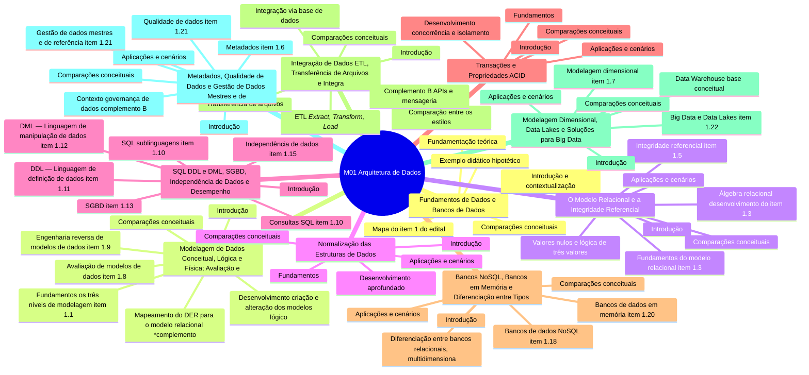

# Mapa mental — Módulo M01: Arquitetura de Dados

Estrutura (arquivos e seções) gerada a partir de `conteudo/01-arquitetura-dados/`. Organiza o conteúdo; não mapeia relações conceituais.

```mermaid
mindmap
  root((M01 Arquitetura de Dados))
    Fundamentos de Dados e Bancos de Dados
      Introdução e contextualização
      Fundamentação teórica
      Mapa do item 1 do edital
      Exemplo didático hipotético
      Comparações conceituais
    Modelagem de Dados Conceitual, Lógica e Física; Avaliação e 
      Introdução
      Fundamentos os três níveis de modelagem item 1.1
      Desenvolvimento criação e alteração dos modelos lógico 
      Mapeamento do DER para o modelo relacional *complemento
      Avaliação de modelos de dados item 1.8
      Engenharia reversa de modelos de dados item 1.9
      Comparações conceituais
    O Modelo Relacional e a Integridade Referencial
      Introdução
      Fundamentos do modelo relacional item 1.3
      Integridade referencial item 1.5
      Álgebra relacional desenvolvimento do item 1.3
      Valores nulos e lógica de três valores
      Comparações conceituais
      Aplicações e cenários
    Normalização das Estruturas de Dados
      Introdução
      Fundamentos
      Desenvolvimento aprofundado
      Comparações conceituais
      Aplicações e cenários
    SQL DDL e DML, SGBD, Independência de Dados e Desempenho
      Introdução
      SGBD item 1.13
      Independência de dados item 1.15
      SQL sublinguagens item 1.10
      DDL — Linguagem de definição de dados item 1.11
      DML — Linguagem de manipulação de dados item 1.12
      Consultas SQL item 1.10
    Transações e Propriedades ACID
      Introdução
      Fundamentos
      Desenvolvimento concorrência e isolamento
      Comparações conceituais
      Aplicações e cenários
    Bancos NoSQL, Bancos em Memória e Diferenciação entre Tipos 
      Introdução
      Bancos de dados NoSQL item 1.18
      Bancos de dados em memória item 1.20
      Diferenciação entre bancos relacionais, multidimensiona
      Comparações conceituais
      Aplicações e cenários
    Integração de Dados ETL, Transferência de Arquivos e Integra
      Introdução
      ETL *Extract, Transform, Load*
      Transferência de arquivos
      Integração via base de dados
      Comparação entre os estilos
      Comparações conceituais
      Complemento B APIs e mensageria
    Modelagem Dimensional, Data Lakes e Soluções para Big Data
      Introdução
      Data Warehouse base conceitual
      Modelagem dimensional item 1.7
      Big Data e Data Lakes item 1.22
      Comparações conceituais
      Aplicações e cenários
    Metadados, Qualidade de Dados e Gestão de Dados Mestres e de
      Introdução
      Metadados item 1.6
      Qualidade de dados item 1.21
      Gestão de dados mestres e de referência item 1.21
      Contexto governança de dados complemento B
      Comparações conceituais
      Aplicações e cenários
```
