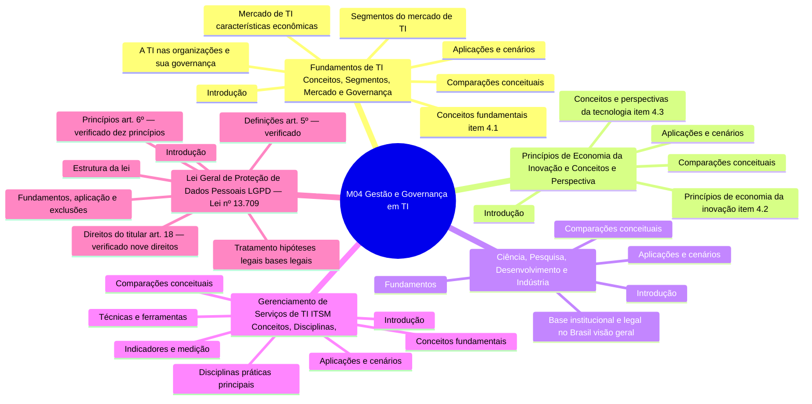

# Mapa mental — Módulo M04: Gestão e Governança em TI

Estrutura (arquivos e seções) gerada a partir de `conteudo/04-governanca-ti/`. Organiza o conteúdo; não mapeia relações conceituais.

```mermaid
mindmap
  root((M04 Gestão e Governança em TI))
    Fundamentos de TI Conceitos, Segmentos, Mercado e Governança
      Introdução
      Conceitos fundamentais item 4.1
      Segmentos do mercado de TI
      Mercado de TI características econômicas
      A TI nas organizações e sua governança
      Comparações conceituais
      Aplicações e cenários
    Princípios de Economia da Inovação e Conceitos e Perspectiva
      Introdução
      Princípios de economia da inovação item 4.2
      Conceitos e perspectivas da tecnologia item 4.3
      Comparações conceituais
      Aplicações e cenários
    Ciência, Pesquisa, Desenvolvimento e Indústria
      Introdução
      Fundamentos
      Base institucional e legal no Brasil visão geral
      Comparações conceituais
      Aplicações e cenários
    Gerenciamento de Serviços de TI ITSM Conceitos, Disciplinas,
      Introdução
      Conceitos fundamentais
      Disciplinas práticas principais
      Técnicas e ferramentas
      Indicadores e medição
      Comparações conceituais
      Aplicações e cenários
    Lei Geral de Proteção de Dados Pessoais LGPD — Lei nº 13.709
      Introdução
      Estrutura da lei
      Fundamentos, aplicação e exclusões
      Definições art. 5º — verificado
      Princípios art. 6º — verificado dez princípios
      Tratamento hipóteses legais bases legais
      Direitos do titular art. 18 — verificado nove direitos
```
