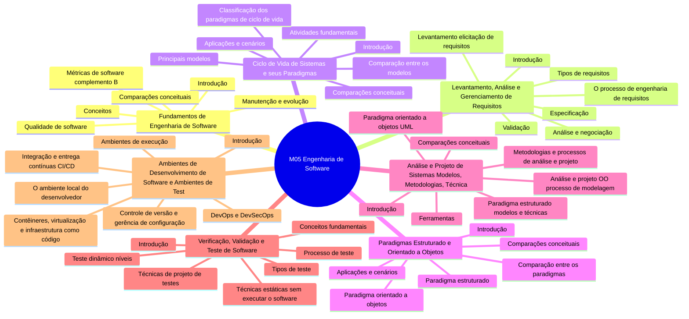

# Mapa mental — Módulo M05: Engenharia de Software

Estrutura (arquivos e seções) gerada a partir de `conteudo/05-engenharia-software/`. Organiza o conteúdo; não mapeia relações conceituais.

```mermaid
mindmap
  root((M05 Engenharia de Software))
    Fundamentos de Engenharia de Software
      Introdução
      Conceitos
      Qualidade de software
      Manutenção e evolução
      Métricas de software complemento B
      Comparações conceituais
    Levantamento, Análise e Gerenciamento de Requisitos
      Introdução
      Tipos de requisitos
      O processo de engenharia de requisitos
      Levantamento elicitação de requisitos
      Análise e negociação
      Especificação
      Validação
    Ciclo de Vida de Sistemas e seus Paradigmas
      Introdução
      Atividades fundamentais
      Classificação dos paradigmas de ciclo de vida
      Principais modelos
      Comparação entre os modelos
      Comparações conceituais
      Aplicações e cenários
    Paradigmas Estruturado e Orientado a Objetos
      Introdução
      Paradigma estruturado
      Paradigma orientado a objetos
      Comparação entre os paradigmas
      Comparações conceituais
      Aplicações e cenários
    Análise e Projeto de Sistemas Modelos, Metodologias, Técnica
      Introdução
      Paradigma estruturado modelos e técnicas
      Paradigma orientado a objetos UML
      Análise e projeto OO processo de modelagem
      Metodologias e processos de análise e projeto
      Ferramentas
      Comparações conceituais
    Verificação, Validação e Teste de Software
      Introdução
      Conceitos fundamentais
      Técnicas estáticas sem executar o software
      Teste dinâmico níveis
      Tipos de teste
      Técnicas de projeto de testes
      Processo de teste
    Ambientes de Desenvolvimento de Software e Ambientes de Test
      Introdução
      O ambiente local do desenvolvedor
      Controle de versão e gerência de configuração
      Integração e entrega contínuas CI/CD
      Ambientes de execução
      Contêineres, virtualização e infraestrutura como código
      DevOps e DevSecOps
```
