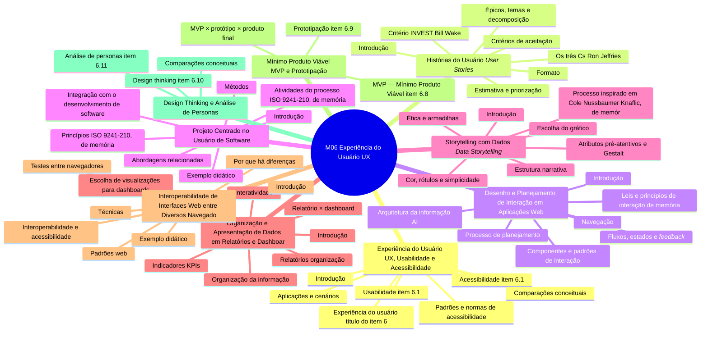

# Mapa mental — Módulo M06: Experiência do Usuário (UX)

Estrutura (arquivos e seções) gerada a partir de `conteudo/06-experiencia-usuario/`. Organiza o conteúdo; não mapeia relações conceituais.

```mermaid
mindmap
  root((M06 Experiência do Usuário UX))
    Experiência do Usuário UX, Usabilidade e Acessibilidade
      Introdução
      Experiência do usuário título do item 6
      Usabilidade item 6.1
      Acessibilidade item 6.1
      Padrões e normas de acessibilidade
      Comparações conceituais
      Aplicações e cenários
    Histórias do Usuário *User Stories*
      Introdução
      Formato
      Os três Cs Ron Jeffries
      Critério INVEST Bill Wake
      Critérios de aceitação
      Épicos, temas e decomposição
      Estimativa e priorização
    Desenho e Planejamento de Interação em Aplicações Web
      Introdução
      Processo de planejamento
      Arquitetura da informação AI
      Navegação
      Fluxos, estados e *feedback*
      Componentes e padrões de interação
      Leis e princípios de interação de memória
    Projeto Centrado no Usuário de Software
      Introdução
      Princípios ISO 9241-210, de memória
      Atividades do processo ISO 9241-210, de memória
      Métodos
      Abordagens relacionadas
      Integração com o desenvolvimento de software
      Exemplo didático
    Storytelling com Dados *Data Storytelling*
      Introdução
      Processo inspirado em Cole Nussbaumer Knaflic, de memór
      Estrutura narrativa
      Escolha do gráfico
      Atributos pré-atentivos e Gestalt
      Cor, rótulos e simplicidade
      Ética e armadilhas
    Organização e Apresentação de Dados em Relatórios e Dashboar
      Introdução
      Relatório × dashboard
      Indicadores KPIs
      Organização da informação
      Escolha de visualizações para dashboards
      Interatividade
      Relatórios organização
    Interoperabilidade de Interfaces Web entre Diversos Navegado
      Introdução
      Por que há diferenças
      Padrões web
      Técnicas
      Testes entre navegadores
      Interoperabilidade e acessibilidade
      Exemplo didático
    Mínimo Produto Viável MVP e Prototipação
      MVP — Mínimo Produto Viável item 6.8
      Prototipação item 6.9
      MVP × protótipo × produto final
    Design Thinking e Análise de Personas
      Design thinking item 6.10
      Análise de personas item 6.11
      Comparações conceituais
```
