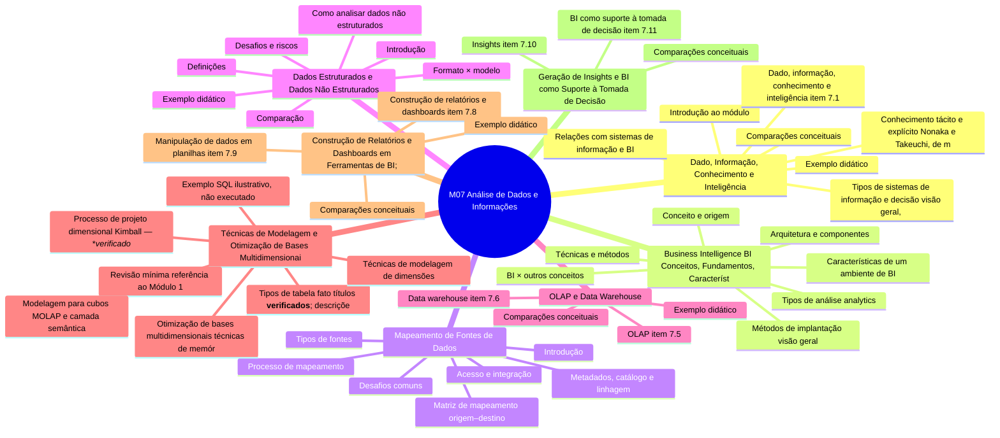

# Mapa mental — Módulo M07: Análise de Dados e Informações

Estrutura (arquivos e seções) gerada a partir de `conteudo/07-analise-dados/`. Organiza o conteúdo; não mapeia relações conceituais.

```mermaid
mindmap
  root((M07 Análise de Dados e Informações))
    Dado, Informação, Conhecimento e Inteligência
      Introdução ao módulo
      Dado, informação, conhecimento e inteligência item 7.1
      Conhecimento tácito e explícito Nonaka e Takeuchi, de m
      Relações com sistemas de informação e BI
      Tipos de sistemas de informação e decisão visão geral, 
      Exemplo didático
      Comparações conceituais
    Business Intelligence BI Conceitos, Fundamentos, Característ
      Conceito e origem
      Arquitetura e componentes
      Características de um ambiente de BI
      Tipos de análise analytics
      Técnicas e métodos
      Métodos de implantação visão geral
      BI × outros conceitos
    Mapeamento de Fontes de Dados
      Introdução
      Tipos de fontes
      Processo de mapeamento
      Matriz de mapeamento origem–destino
      Metadados, catálogo e linhagem
      Desafios comuns
      Acesso e integração
    Dados Estruturados e Dados Não Estruturados
      Introdução
      Definições
      Comparação
      Formato × modelo
      Como analisar dados não estruturados
      Desafios e riscos
      Exemplo didático
    OLAP e Data Warehouse
      Data warehouse item 7.6
      OLAP item 7.5
      Comparações conceituais
      Exemplo didático
    Técnicas de Modelagem e Otimização de Bases Multidimensionai
      Revisão mínima referência ao Módulo 1
      Processo de projeto dimensional Kimball — **verificado*
      Tipos de tabela fato títulos **verificados**; descriçõe
      Técnicas de modelagem de dimensões
      Modelagem para cubos MOLAP e camada semântica
      Otimização de bases multidimensionais técnicas de memór
      Exemplo SQL ilustrativo, não executado
    Construção de Relatórios e Dashboards em Ferramentas de BI; 
      Construção de relatórios e dashboards item 7.8
      Manipulação de dados em planilhas item 7.9
      Exemplo didático
      Comparações conceituais
    Geração de Insights e BI como Suporte à Tomada de Decisão
      Insights item 7.10
      BI como suporte à tomada de decisão item 7.11
      Comparações conceituais
```
