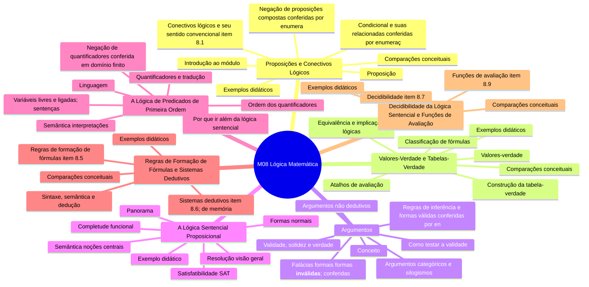

# Mapa mental — Módulo M08: Lógica Matemática

Estrutura (arquivos e seções) gerada a partir de `conteudo/08-logica-matematica/`. Organiza o conteúdo; não mapeia relações conceituais.

```mermaid
mindmap
  root((M08 Lógica Matemática))
    Proposições e Conectivos Lógicos
      Introdução ao módulo
      Proposição
      Conectivos lógicos e seu sentido convencional item 8.1
      Negação de proposições compostas conferidas por enumera
      Condicional e suas relacionadas conferidas por enumeraç
      Exemplos didáticos
      Comparações conceituais
    Valores-Verdade e Tabelas-Verdade
      Valores-verdade
      Construção da tabela-verdade
      Classificação de fórmulas
      Equivalência e implicação lógicas
      Atalhos de avaliação
      Exemplos didáticos
      Comparações conceituais
    Argumentos
      Conceito
      Validade, solidez e verdade
      Como testar a validade
      Regras de inferência e formas válidas conferidas por en
      Falácias formais formas **inválidas**; conferidas
      Argumentos categóricos e silogismos
      Argumentos não dedutivos
    A Lógica Sentencial Proposicional
      Panorama
      Semântica noções centrais
      Formas normais
      Resolução visão geral
      Completude funcional
      Satisfatibilidade SAT
      Exemplo didático
    A Lógica de Predicados de Primeira Ordem
      Por que ir além da lógica sentencial
      Linguagem
      Quantificadores e tradução
      Negação de quantificadores conferida em domínio finito
      Ordem dos quantificadores
      Variáveis livres e ligadas; sentenças
      Semântica interpretações
    Regras de Formação de Fórmulas e Sistemas Dedutivos
      Regras de formação de fórmulas item 8.5
      Sintaxe, semântica e dedução
      Sistemas dedutivos item 8.6; de memória
      Exemplos didáticos
      Comparações conceituais
    Decidibilidade da Lógica Sentencial e Funções de Avaliação
      Funções de avaliação item 8.9
      Decidibilidade item 8.7
      Exemplos didáticos
      Comparações conceituais
```
