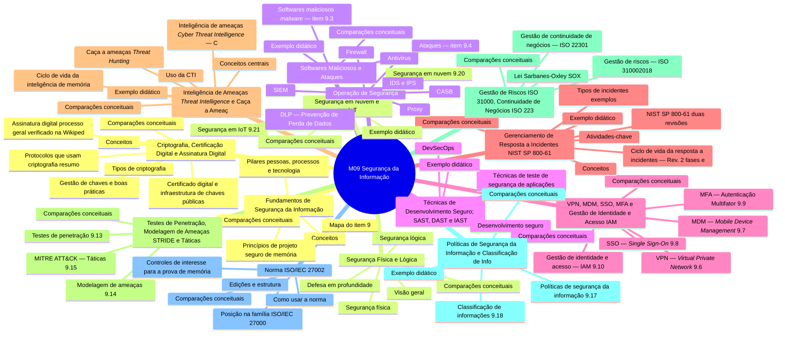

# Mapa mental — Módulo M09: Segurança da Informação

Estrutura (arquivos e seções) gerada a partir de `conteudo/09-seguranca-informacao/`. Organiza o conteúdo; não mapeia relações conceituais.

```mermaid
mindmap
  root((M09 Segurança da Informação))
    Fundamentos de Segurança da Informação
      Conceitos
      Princípios de projeto seguro de memória
      Pilares pessoas, processos e tecnologia
      Mapa do item 9
      Comparações conceituais
    Segurança Física e Lógica
      Visão geral
      Segurança física
      Segurança lógica
      Defesa em profundidade
      Comparações conceituais
    Softwares Maliciosos e Ataques
      Softwares maliciosos *malware* — item 9.3
      Ataques — item 9.4
      Exemplo didático
      Comparações conceituais
    Técnicas de Desenvolvimento Seguro; SAST, DAST e IAST
      Desenvolvimento seguro
      Técnicas de teste de segurança de aplicações
      DevSecOps
      Exemplo didático
      Comparações conceituais
    VPN, MDM, SSO, MFA e Gestão de Identidade e Acesso IAM
      VPN — *Virtual Private Network* 9.6
      MDM — *Mobile Device Management* 9.7
      SSO — *Single Sign-On* 9.8
      MFA — Autenticação Multifator 9.9
      Gestão de identidade e acesso — IAM 9.10
      Comparações conceituais
    Gerenciamento de Resposta a Incidentes NIST SP 800-61
      Conceitos
      NIST SP 800-61 duas revisões
      Ciclo de vida da resposta a incidentes — Rev. 2 fases e
      Atividades-chave
      Tipos de incidentes exemplos
      Exemplo didático
      Comparações conceituais
    Inteligência de Ameaças *Threat Intelligence* e Caça a Ameaç
      Inteligência de ameaças *Cyber Threat Intelligence* — C
      Conceitos centrais
      Ciclo de vida da inteligência de memória
      Uso da CTI
      Caça a ameaças *Threat Hunting*
      Exemplo didático
      Comparações conceituais
    Testes de Penetração, Modelagem de Ameaças STRIDE e Táticas 
      Testes de penetração 9.13
      Modelagem de ameaças 9.14
      MITRE ATT&CK — Táticas 9.15
      Comparações conceituais
    Gestão de Riscos ISO 31000, Continuidade de Negócios ISO 223
      Gestão de riscos — ISO 310002018
      Gestão de continuidade de negócios — ISO 22301
      Lei Sarbanes-Oxley SOX
      Comparações conceituais
    Políticas de Segurança da Informação e Classificação de Info
      Políticas de segurança da informação 9.17
      Classificação de informações 9.18
      Exemplo didático
      Comparações conceituais
    Norma ISO/IEC 27002
      Posição na família ISO/IEC 27000
      Edições e estrutura
      Controles de interesse para a prova de memória
      Como usar a norma
      Comparações conceituais
    Criptografia, Certificação Digital e Assinatura Digital
      Conceitos
      Tipos de criptografia
      Assinatura digital processo geral verificado na Wikiped
      Certificado digital e infraestrutura de chaves públicas
      Protocolos que usam criptografia resumo
      Gestão de chaves e boas práticas
      Comparações conceituais
    Segurança em Nuvem e em IoT
      Segurança em nuvem 9.20
      Segurança em IoT 9.21
      Exemplo didático
      Comparações conceituais
    Operação de Segurança
      Firewall
      Proxy
      IDS e IPS
      DLP — Prevenção de Perda de Dados
      CASB
      SIEM
      Antivírus
```
